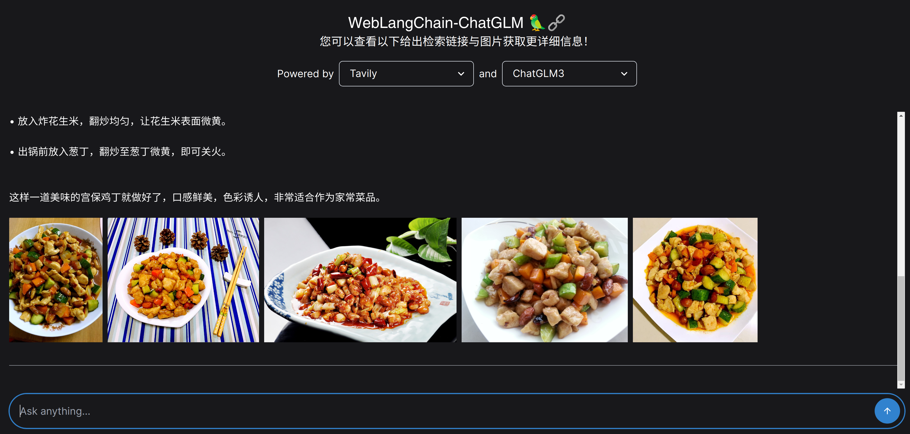

# 🦜️🌐 WebLangChain-ChatGLM3

This code repository is built on LangChain and supports the invocation of models such as OpenAI ChatGPT and ChatGLM3. It also implements Retrieval Augmented Generation (RAG) functionality through retrieval libraries like Tavily, enabling the use of the entire internet as a document repository for retrieval to alleviate issues related to the hallucination problem in large language models.

## 😀 Demo
- image demo

- gif demo

## ✅ Local Setup

### ChatGLM3 Environment Configuration and Execution
Isolate the environment using conda：`conda create -n chatglm python==3.10; conda activate chatglm` (Note: It is important to isolate the environments for ChatGLM3 and WebLangChain to avoid compatibility issues with library versions.)

1. Pull the ChatGLM3 code submodule: `git submodule update --init --recursive`
2. Download the ChatGLM3 Hugging Face model: `git clone https://huggingface.co/THUDM/chatglm3-6b`
3. Set the environment variable for the ChatGLM3 model path: `export MODEL_PATH=$(realpath ./chatglm3-6b)`
4. Install environment dependencies: `pip install -r requirements.txt`
5. Deploy the ChatGLM3 model service: `cd openai_api_demo; python3 openai_api.py`

### WebLangChain Environment Configuration and Execution

Isolate the environment using conda: `conda create -n weblangchain python==3.10; conda activate weblangchain`

1. Install backend dependencies: `poetry install`.
2. Set the environment variables: `source env.sh`
  - Note: Make sure to set environment variables to configure the application. By default, WebLangChain uses [Tavily](https://tavily.com) to retrieve content from web pages. Obtain a Tavily API key through [Tavily registration](https://tavily.com/), and update it in `./env.sh`. Also, obtain an openai API key through [OpenAI registration]((https://openai.com/blog/openai-api)) and update it in `./env.sh`. If you want to add or replace a different base retriever (e.g., using your own data source), update the `get_retriever()` method in `main.py`.
3. Start the Python backend: `poetry run make start`.
4. Run yarn to install frontend dependencies:
  - Install Node Version Manager (NVM): `wget -qO- https://raw.githubusercontent.com/nvm-sh/nvm/v0.39.5/install.sh | zsh`
  - Set NVM environment variables: `export NVM_DIR="${XDG_CONFIG_HOME:-$HOME}/.nvm"; [ -s "$NVM_DIR/nvm.sh" ] && \. "$NVM_DIR/nvm.sh"`
  - Install Node.js version 18: `nvm install 18`
  - Use Node.js version 18: `nvm use 18`
  - Navigate to the "nextjs" directory and install dependencies using Yarn: `cd nextjs; yarn`.
5. Start the frontend: `yarn dev`.
6. Open [localhost:3000](http://localhost:3000) in a web browser.

## ⚙️ Operation Principles

The general retrieval process is as follows:

1. Use a retriever with the Search API wrapped around Tavily to fetch raw content relevant to the user's initial query.
    - For subsequent dialogue turns, we rephrase the original query into a "standalone query" that does - not reference the previous chat history.
2. Since the size of the original document often exceeds the maximum context window size of the model, we perform additional context compression steps to filter the content passed to the model.
    - First, use a text splitter to split the retrieved document.
    - Then, use an embeddings filter to remove any blocks that do not meet the similarity threshold with the initial query.
3. Pass the retrieved context, chat history, and original question to the language model as the final context for generation.

## 🤗 Acknowledgments
The construction of this code repository is based on the following libraries:

- [weblangchain](https://github.com/langchain-ai/weblangchain)
- [ChatGLM3](https://github.com/THUDM/ChatGLM3/)
- [Tavily](https://tavily.com)
- [LangChain](https://github.com/langchain-ai/langchain/)
- [LangServe](https://github.com/langchain-ai/langserve)
- [FastAPI](https://fastapi.tiangolo.com/)
- [Next.js](https://nextjs.org)

