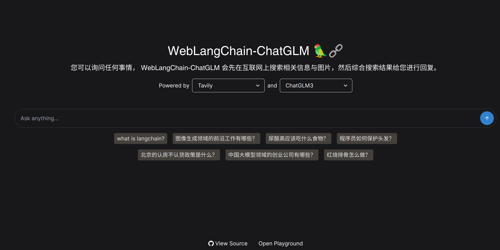
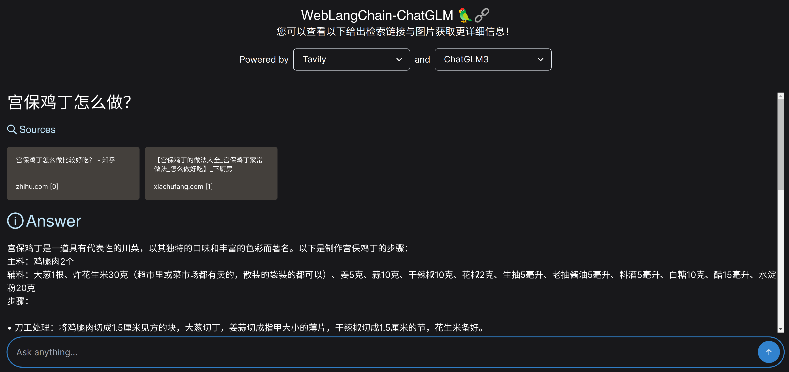
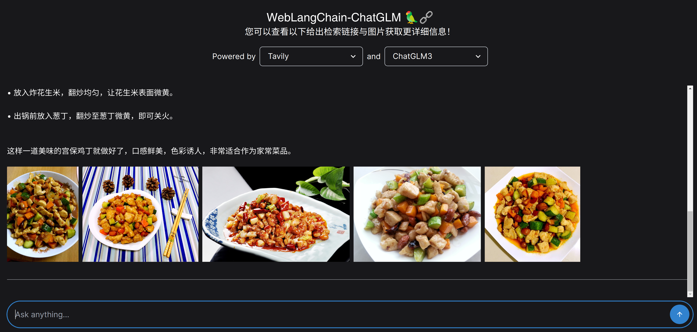
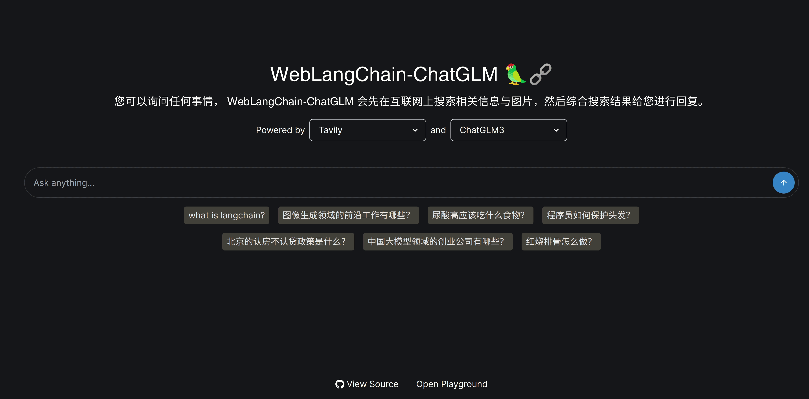

# 🦜️🌐 WebLangChain-ChatGLM3

本代码库基于 LangChain 构建，支持OpenAI ChatGPT、ChatGLM3 等模型调用，同时通过 Tavily 等检索库实现检索增强生成（Retrieval Augmented Generation，RAG）功能，能够使用整个互联网作为文档存储库执行检索来缓解大语言模型的幻觉问题

## 😀 使用样例展示
- 图片样例

- GIF 样例

## ✅ 本地运行

### ChatGLM3 环境配置与运行方式
基于 conda 进行环境隔离：`conda create -n chatglm python==3.10; conda activate chatglm` (注意 `ChatGLM3` 和 `WebLangChain` 环境隔离很重要，能避免一些库版本不兼容问题)

1. 拉取 ChatGLM3 代码模块：`git submodule update --init --recursive`
2. 下载 ChatGLM3 的 huggingface 模型: `git clone https://huggingface.co/THUDM/chatglm3-6b`
3. 添加 ChatGLM3 模型路径的环境变量：`export MODEL_PATH=$(realpath ./chatglm3-6b)`
4. 安装环境依赖：`pip install -r requirements.txt`
5. 部署 ChatGLM3 模型服务: `cd openai_api_demo; python3 openai_api.py`

### WebLangChain 环境配置与运行方式

基于 conda 进行环境隔离：`conda create -n weblangchain python==3.10; conda activate weblangchain`

1. 安装后端依赖项: `poetry install`.
2. 添加环境变量： `source env.sh`
  - 注：确保设置环境变量以配置应用程序，默认情况下，WebLangChain 使用 [Tavily](https://tavily.com) 从网页获取内容。可以通过 [tavily 注册](https://tavily.com/) 获取 tavily API 密钥，并更新到 `./env.sh` 中。同时需要在 [openai 注册](https://openai.com/blog/openai-api) 获取 openai API 密钥更新到 `./env.sh` 中。如果想要添加或替换不同的基本检索器（例如，如果想要使用自己的数据源），可以在 `main.py` 中更新 `get_retriever()` 方法。
3. 启动 Python 后端: `poetry run make start`.
4. 运行 yarn 安装前端依赖项:
  - 安装 Node Version Manager (NVM): `wget -qO- https://raw.githubusercontent.com/nvm-sh/nvm/v0.39.5/install.sh | zsh` (可能需要替换 `zsh` 为用户使用的版本，如 `bash`)
  - 设置 NVM 环境变量: `export NVM_DIR="${XDG_CONFIG_HOME:-$HOME}/.nvm"; [ -s "$NVM_DIR/nvm.sh" ] && \. "$NVM_DIR/nvm.sh"`
  - 安装 Node.js 版本 18: `nvm install 18`
  - 使用 Node.js 版本 18: `nvm use 18`
  - 进入 "nextjs" 目录并使用 Yarn 安装依赖: `cd nextjs; yarn`.

5. 启动前端: `yarn dev`.
6. 在浏览器中打开 [localhost:3000](http://localhost:3000).

## ⚙️ 工作原理

一般的检索流程如下：

1. 使用包装了 Tavily 的 Search API 的检索器拉取与用户初始查询相关的原始内容。
    - 对于随后的对话轮次，我们还将原始查询重新表述为不包含对先前聊天历史的引用的 "独立查询 (standalone query)"。
2. 由于原始文档的大小通常超过模型的最大上下文窗口大小，我们执行额外的 [上下文压缩步骤](https://python.langchain.com/docs/modules/data_connection/retrievers/contextual_compression/) 来筛选传递给模型的内容。
    - 首先，使用 [文本拆分器](https://python.langchain.com/docs/modules/data_connection/document_transformers/) 拆分检索到的文档。
    - 然后，使用 [嵌入过滤器](https://python.langchain.com/docs/modules/data_connection/retrievers/contextual_compression/#embeddingsfilter) 删除与初始查询不符合相似性阈值的任何块。
3. 将检索到的上下文、聊天历史和原始问题传递给 LLM 作为最终生成的上下文。

## 🤗 致谢
本代码库参考以下库进行构建:

- [weblangchain](https://github.com/langchain-ai/weblangchain)
- [ChatGLM3](https://github.com/THUDM/ChatGLM3/)
- [Tavily](https://tavily.com)
- [LangChain](https://github.com/langchain-ai/langchain/)
- [LangServe](https://github.com/langchain-ai/langserve)
- [FastAPI](https://fastapi.tiangolo.com/)
- [Next.js](https://nextjs.org)

